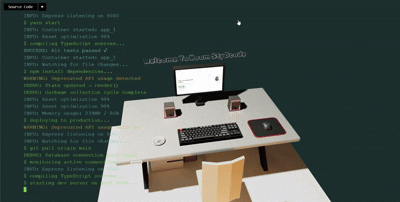
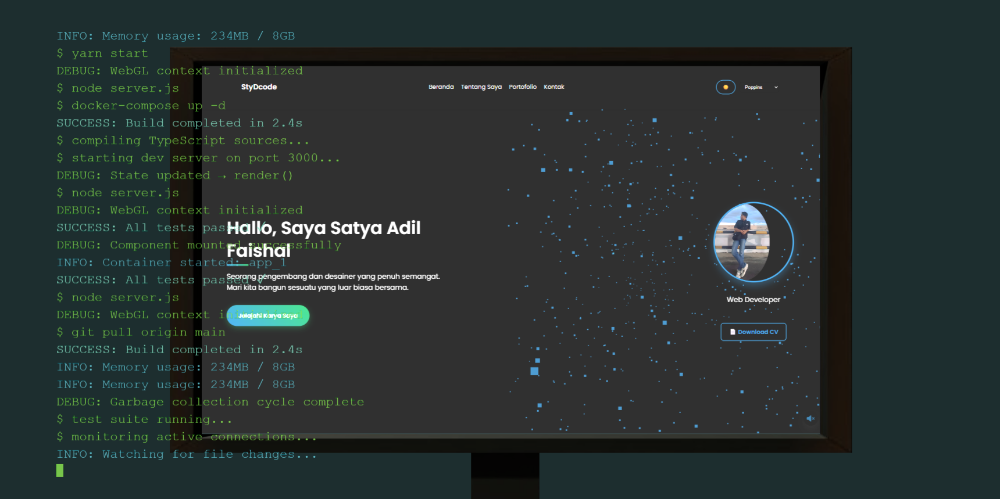

# SatyaRoom

SatyaRoom adalah proyek **ruangan virtual 3D interaktif** yang dibuat dengan **Three.js**, **TypeScript**, dan **Blender**.  
Proyek ini saya kembangkan sebagai landing page kreatif untuk memperkenalkan website dan blog pribadi.  

🔗 Live demo: [roomstydcode.netlify.app](https://roomstydcode.netlify.app/)

---

## Deskripsi

Ruangan ini menampilkan elemen personal sekaligus link navigasi menuju website saya.  
Inspirasi datang dari karya Bruno Simon dan beberapa kreator web 3D lainnya.  

---

## Preview

## Screenshot Landing Page

---

## Teknologi

- **Three.js** – rendering 3D  
- **TypeScript** – struktur kode yang lebih terjaga  
- **Blender** – pembuatan dan export model 3D  
- **Netlify** – deployment & hosting  

---

## Fitur

- Ruangan 3D interaktif  
- Tekstur dan dekorasi personal  
- Musik latar dari [Pixabay Music](https://pixabay.com/music/)  
- Navigasi link ke website/blog  

---

## Rencana Pengembangan

- [x] Implementasi tekstur  
- [x] Tambah musik latar  
- [ ] Optimisasi performa (loading lebih cepat)  
- [ ] Dekorasi tambahan (foto, poster, logo AIN, dll.)  

---

## Lisensi

Proyek ini dirilis dengan lisensi **MIT**.  
Silakan gunakan kembali dengan menyertakan atribusi.
