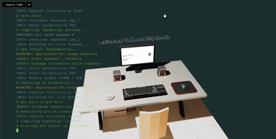
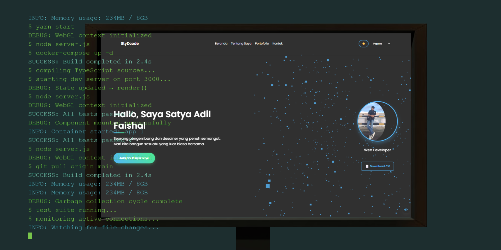

# SatyaRoom

SatyaRoom adalah proyek **ruangan virtual 3D interaktif** yang dibuat dengan **Three.js**, **TypeScript**, dan **Blender**.  
Proyek ini saya kembangkan sebagai landing page kreatif untuk memperkenalkan website dan blog pribadi.  

🔗 Live demo: [roomstydcode.netlify.app](https://roomstydcode.netlify.app/)

---

## Deskripsi

Ruangan ini menampilkan elemen personal sekaligus link navigasi menuju website saya.  
Inspirasi datang dari karya Bruno Simon dan beberapa kreator web 3D lainnya.  

---

## Preview

<<<<<<< HEAD

## Screenshot Landing Page

=======
  
*(tambahkan screenshot landing page di sini)*
>>>>>>> 4df077e (Update README.md)

---

## Teknologi

<<<<<<< HEAD
- **Three.js** – rendering 3D  
- **TypeScript** – struktur kode yang lebih terjaga  
- **Blender** – pembuatan dan export model 3D  
- **Netlify** – deployment & hosting  
=======
- Three.js – rendering 3D  
- TypeScript – struktur kode yang lebih terjaga  
- Blender – pembuatan dan export model 3D  
- Netlify – deployment & hosting  
>>>>>>> 4df077e (Update README.md)

---

## Fitur

- Ruangan 3D interaktif  
- Tekstur dan dekorasi personal  
- Musik latar dari [Pixabay Music](https://pixabay.com/music/)  
- Navigasi link ke website/blog  

---

## Rencana Pengembangan

- [x] Implementasi tekstur  
- [x] Tambah musik latar  
- [ ] Optimisasi performa (loading lebih cepat)  
- [ ] Dekorasi tambahan (foto, poster, logo AIN, dll.)  

---

## Lisensi

<<<<<<< HEAD
Copyright (c) 2025 Satya Adil Faishal
All rights reserved.

Unauthorized copying, modification, distribution, or use of this project, 
via any medium, is strictly prohibited without the prior written permission 
of the author.

=======
Proyek ini dirilis dengan lisensi **MIT**.  
Silakan gunakan kembali dengan menyertakan atribusi.
>>>>>>> 4df077e (Update README.md)
